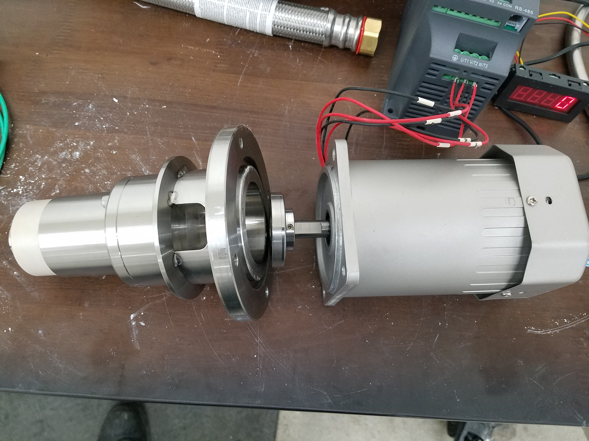

# Ambercycle

At Ambercycle I worked as the lead engineer to create systems and processes from the ground up. 

## Machine Shop

After we acquire a new space one of my first big projects was to design a lab space and a machine shop.

## Lab-Scale Reactors

Before joining Ambercycle permanently I was asked to create a lab-sclae reactor and filter system.
At the time they needed it to fit inside a benchtop hood. The design, though compact, was very successful and I was offered a permanent position shortly afterwards. 

After the [machine shop](#machine-shop) was completed I immediately began constructing lab-scale reactors to study new processes.

Prior to building the [Ambition](#ambition) pilot-scale reactor, the following lab-scale reactor was created to prove out the process:

Tri-Clamp parts were leveraged as often as possible to speed up the assembly process and allow for fast changes to the design.

And when specific tri-clamp parts were not avaliable, they were created by modifying tri-clamp caps.

This filter was modified to have a hot-oil jacket, by using the 12in flange on to bottom an offset was also created that was used to hold the filters in place once assembled.

I was also able to source inexpensive VFD's and 3PH motors to create low-cost programmable stirring systems with high-torque.

Here again is the assemble reactor, this system was designed, built, and operational in only two weeks time. 

## Ambition

My first Pilot-Scale reactor was aptly names Ambition. The goal was to build a system around a Netuche filter that had been purchased used.
Restoring the filter to operation was not without it's challenges, but we succeeded in putting this systems together in about three months.
Because of the agressive timeline, I had to create custom solutions where more favorable solutions would take too long to procure.

One of these custom solutions was a magnetically coupled stir-motor for the reactor. 
Because we were working with difficult solvents, traditional seals were not a favorable option.
My solution was to machine this system and magnetically couple the shaft and motor through a very thin ~2mm sheet of SS316.
This sheet was actually just a portion of a tri-clamp cap that had been thinned out in the middle.
The stirring section was built using 316SS and featured a custom labrinth seal and full ceramic bearings.
It was a lot of work, but I was able to design, procure, machine, and assemble the whole system very quickly.

Here the system is shown with the VFD in place as well.

A close up shows how the system was couples through a thinned out tri-clamp cap.

Here the system is shown with the shaft and labrinth seal installed.

This is a very early view of anbition just after the Netuche filter and platform were installed.

Since the project was on a rush schedule I had to refurbish the included hydraulic system with readily avaliable parts.

Here we have the reactor and crystallizer staged for installation.

.jpg)

And here is the fully assembled system.

The Netuche filter is quite a nice system once operational.

Another feature of our system was the crystallizer, I created and optmized a nozzle system to inject the dissolved polymer into an anti-solvent.
The goal here is to create uniform crystals and avoid agglomerization so washing and drying are more efficient.

## Solace

