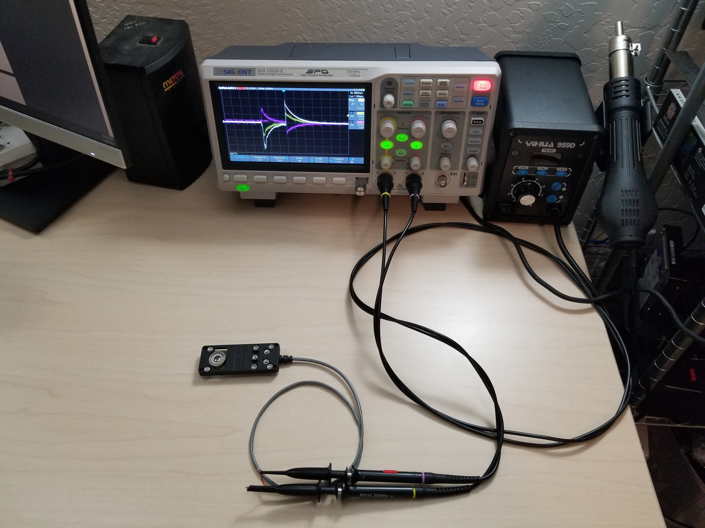
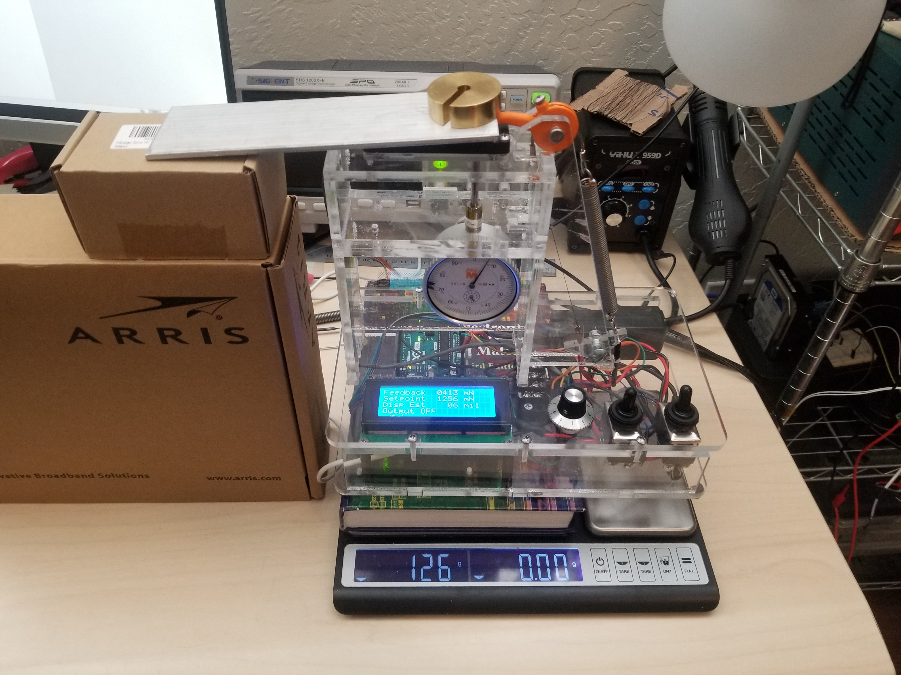
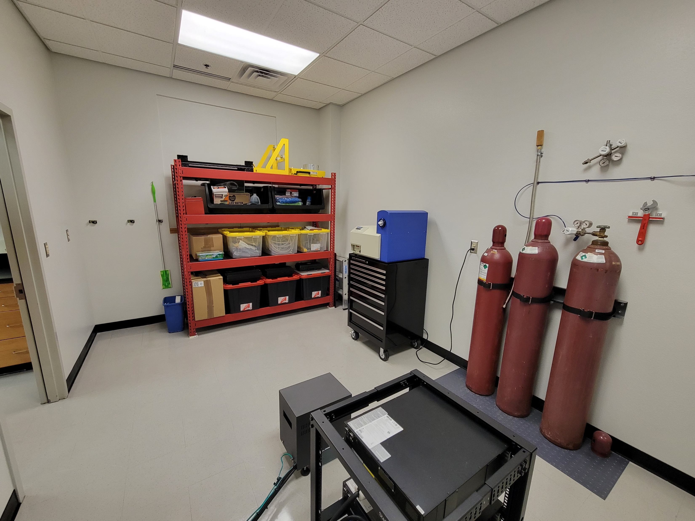
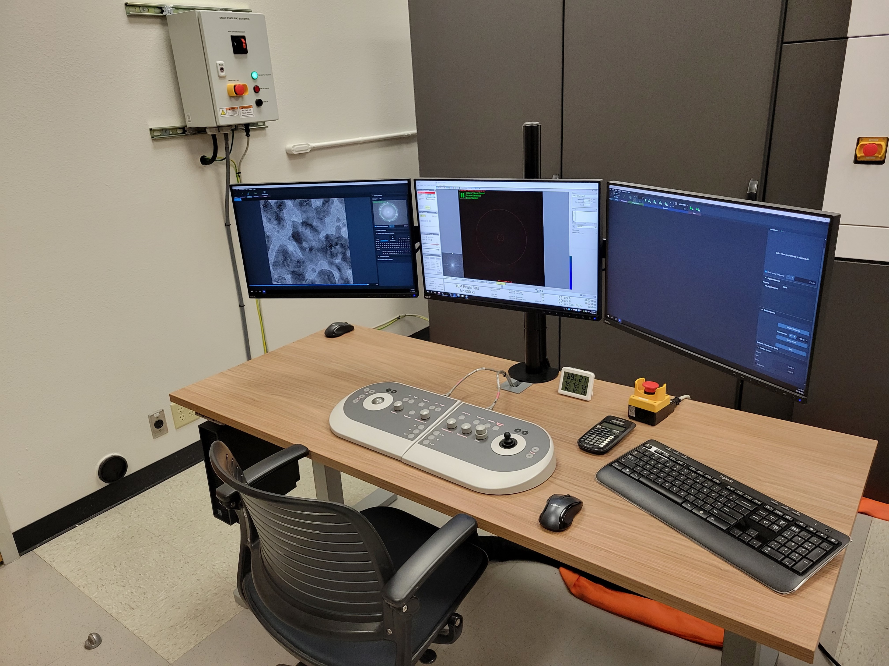
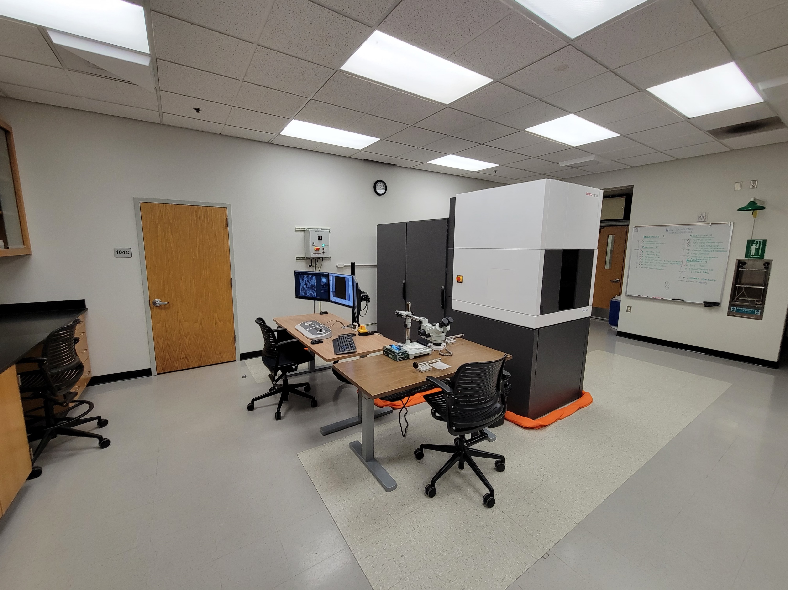
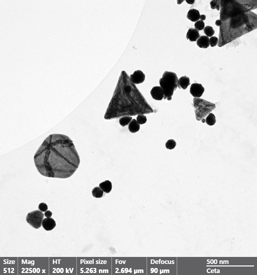
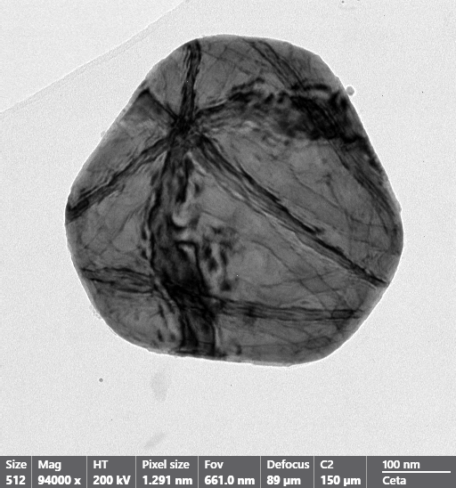
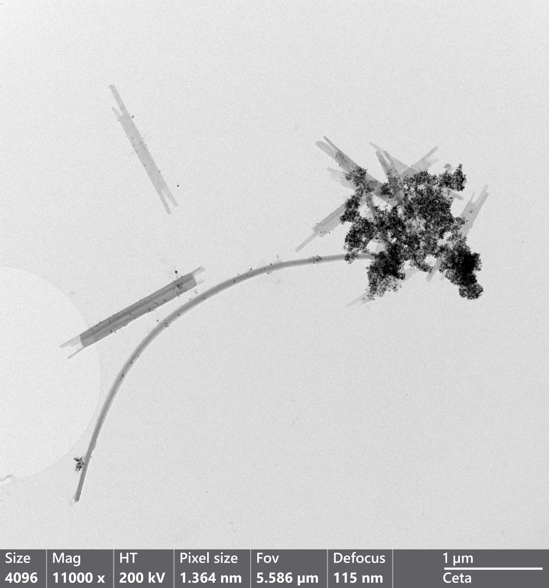
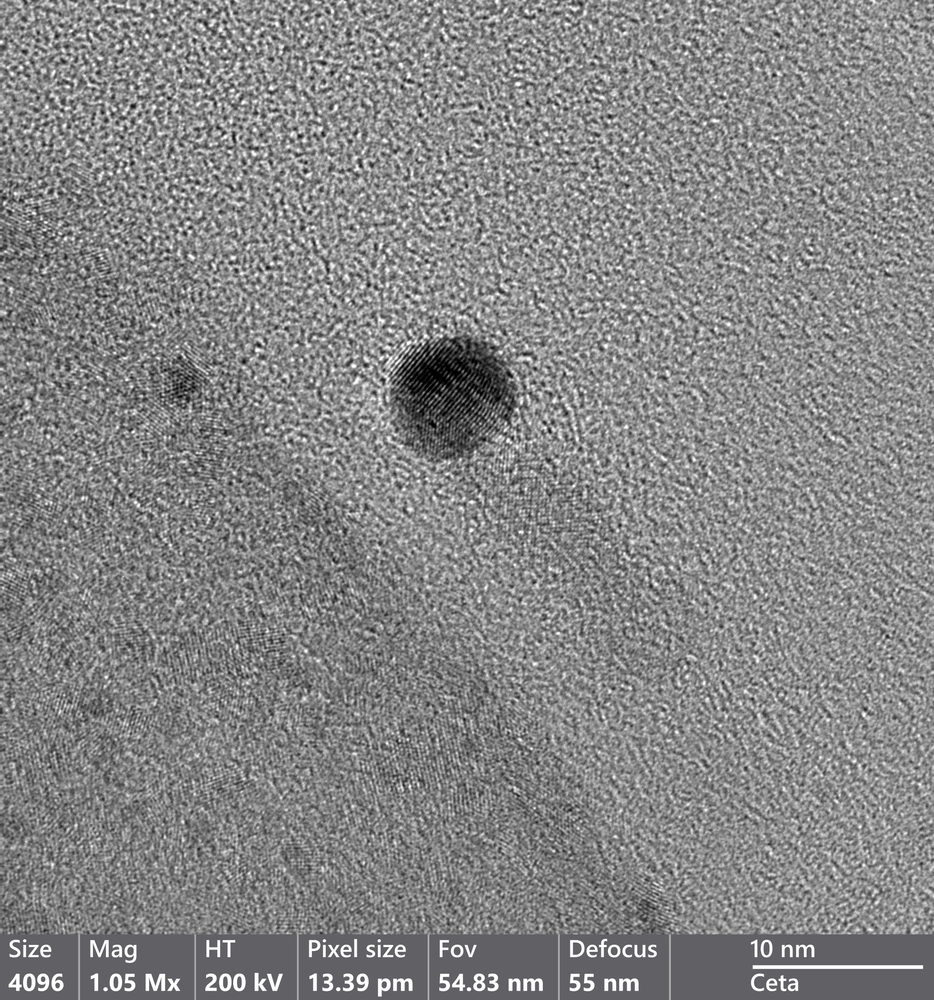

# Northern Arizona University

## Mechanical Engineering 575 Smart Materials and Systems

## PhD

The image above is a collection of Large Angle Convergent Beam Electron Diffraction (LACBED) patterns.
These were generated on a Transmission Electron Microscope (TEM) with a silicon sample. Diffraction patterns made using LACBED, or more generally, using Convergent Beam Electron Diffraction (CBED) contain a great deal of information, and while their interpretation is more involved it is possible to fully determine a crystal system using patterns such as these. Furthermore they provide a means to measure localized strain and imperfections with precision.

