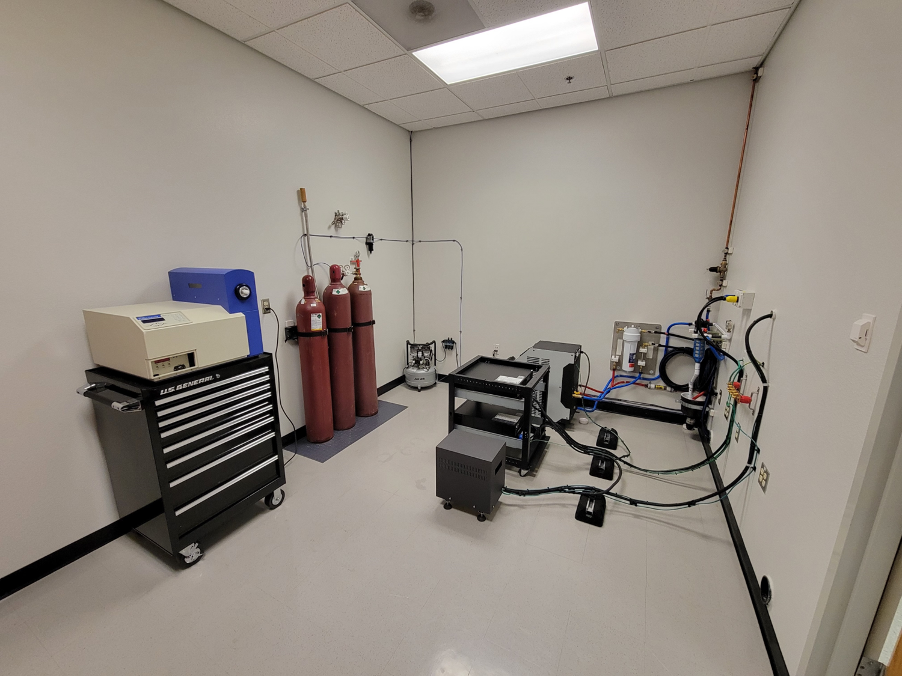

# Northern Arizona University

## PhD

In the fall of 2020 I made the decision to go back to school and get a PhD. Not long before that Northern Arizona University (NAU) had created a new department for Applied Physics and Materials Science (APMS). In creating the new department the school had recruited Dr. Miguel Jose Yacaman. Dr. Yacaman has long been regarded in Transmission Electron Microscopy. I decided to attend NAU because I wanted to work with Dr. Yacaman, and because I have always liked the natural beauty of Flagstaff Arizona. 

While attending I was able to take a lead role in creating a laboratory for a Transmission Electron Microscope that Dr. Yacaman had purchased. 

The image above is a collection of Large Angle Convergent Beam Electron Diffraction (LACBED) patterns.
These were generated on a Transmission Electron Microscope (TEM) with a silicon sample. Diffraction patterns made using LACBED, or more generally, using Convergent Beam Electron Diffraction (CBED) contain a great deal of information, and while their interpretation is more involved it is possible to fully determine a crystal system using patterns such as these. Furthermore they provide a means to measure localized strain and imperfections with precision.

## Mechanical Engineering 575 Smart Materials and Systems

